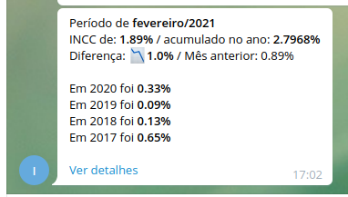

# INCC Crawler

Repository responsible for crawling INCC index data.
INCC means "Indice Nacional de Construçao Civil" in Brazil and it tracks inflation of construct materials.

This crawler crawls these data and trigger telegram alerts.

